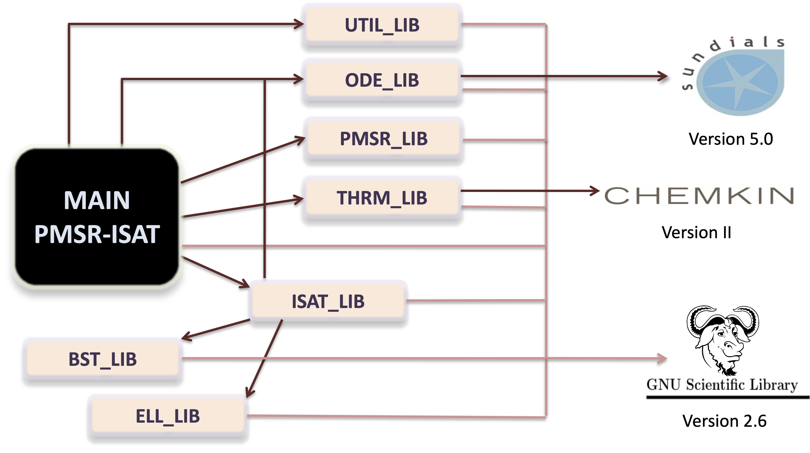

## Chemically Reacting Flow Library

**CRFlowLib - Chemically Reacting Flow Library** is a comprehensive collection of computational libraries for simulating chemically reacting flows using the In Situ Adaptive Tabulation (ISAT) algorithm for thermochemistry calculations.

<p align="center">

</p>

## Table of Contents
- [Overview](#overview)
- [Features](#features)
- [Compilation](#compilation)
- [Program execution](#program-execution)
- [Documentation](#documentation)
- [External dependencies](#external-dependencies)
- [Reaction mechanisms](#reaction-mechanisms)
- [Reproducibility](#reproducibility)
- [Authors](#authors)
- [Citing CRFlowLib](#citing-crflowlib)
- [License](#license)
- [Institutional support](#institutional-support)
- [Funding](#funding)
- [Contact](#contact)

## Overview
**CRFlowLib** was developed focused on reducing complexity in combustion thermochemistry. It provides a robust framework for simulating chemically reacting flows, leveraging the ISAT algorithm for efficient thermochemistry calculations. The package includes routines that are well-documented and easy to use, making it accessible for both educational and research purposes.

This library is the result of a master's thesis:
- **A. Cunha Jr**, *Reduction of Complexity in Combustion Thermochemistry*, PUC-Rio, Master Thesis, 2010 <a href="https://doi.org/10.17771/PUCRio.acad.17685" target="_blank">DOI</a>
 
The PDF of this thesis is also available <a href="https://hal.archives-ouvertes.fr/tel-01541173" target="_blank">here</a>.

The results of this thesis were disclosed in the following publication:
- **A. Cunha Jr and L. F. Figueira da Silva**, *Assessment of a transient homogeneous reactor through in situ adaptive tabulation*, Journal of the Brazilian Society of Mechanical Sciences and Engineering, v. 36, pp. 377-391, 2014 <a href="http://dx.doi.org/10.1007/s40430-013-0080-4 " target="_blank">DOI</a> 
 
Preprint available <a href="https://hal.archives-ouvertes.fr/hal-01438646" target="_blank">here</a>.

### Features
- Simulates chemically reacting flows using the ISAT algorithm
- Includes routines for thermochemistry calculations
- Well-documented code with detailed comments
- Example scripts for representative benchmark tests
- Compatible with both GNU Scientific Library and CVODE

### Compilation
To get started with **CRFlowLib**, follow these steps:
1. Clone the repository:
   ```bash
   git clone https://github.com/americocunhajr/CRFlowLib.git
   ```
2. Navigate to the code directory:
   ```bash
   cd CRFlowLib/CRFlowLib-2.0
   ```
3. Compile all modules using the Makefile:
   ```bash
   make
   ```
4. To compile a specific program type:
   ```bash
   make program-title.exe # e.g., pmsr-isat.exe
   ```
See the Makefile for further details.

Users can use the file 'main__pmsr-isat.c' as a baseline to define their own simulation problems.

### Program execution
All programs depend on the ‘chem.bin’ file generated by ‘chem.exe’ program.

1. To obtain the ‘chem.bin’ file type:
   ```bash
   make run_chem
   ```
2. To compile a specific program type:
   ```bash
   make run_program-title # e.g make run_pmsr-isat, make run_pmsr-di etc
   ```

See the Makefile for further details.

### Documentation
**CRFlowLib** routines are thoroughly commented to explain their functionality. Each routine includes a short description of its purpose and a list of inputs and outputs. Users can refer to the example scripts provided to understand how to set up and run their simulations.

### External dependencies

##### CRFlowLib-1.0 - the original implementation
* <a href="https://www.gnu.org/software/gsl" target="_blank">GNU Scientific Library 1.12</a> (open source)  
* CVODE 2.5.0, which is part of <a href="https://computing.llnl.gov/projects/sundials" target="_blank">SUNDIALS 2.3.0</a> (open source)
* Chenkin-II (proprietary software) --- Once this code is proprietary, you need to obtain its routines by yourself.

The following Chenkin-II libraries are necessary:
 - cklib.f
 - ckinterp.f
 - ckstrt.h

##### CRFlowLib-2.0 - an updated implementation
* <a href="https://www.gnu.org/software/gsl" target="_blank">GNU Scientific Library 2.6</a> (open source)
* CVODE 5.0.0, which is part of <a href="https://computing.llnl.gov/projects/sundials" target="_blank">SUNDIALS 5.0.0</a> (open source)
* Chenkin-II (proprietary software) --- Once this code is proprietary, you need to obtain its routines by yourself.

The following Chenkin-II libraries are necessary:
- cklib.f
- ckinterp.f
- ckstrt.h

### Reaction mechanisms
This repository stores a collection of thermochemistry mechanisms in Chemkin-II format. These kinetic mechanisms were developed by several research groups that works in the simulation of chemically reactive flows. This collection is the result of more than 15 years of search. All of these mechanisms were made available, at some time, on the Internet or in specialized literature. 

The repository owner makes them available here with the intention that they may be useful for researchers interested in the topic. Unfortunately, no guarantee can be given regarding the integrity of the files or the accuracy of the mechanisms. Use it at your own risk!

### Reproducibility
Simulations done with **CRFlowLib** are fully reproducible, as can be seen on this <a href="https://codeocean.com/capsule/2804669/tree/v1" target="_blank">CodeOcean capsule</a>

### Authors
- Americo Cunha (UERJ)
- Luis Fernando Figueira da Silva (PUC-Rio / Institut Pprime)

### Citing CRFlowLib
If you use **CRFlowLib** in your research, please cite the following references:
- *A. Cunha Jr and L. F. Figueira da Silva, CRFlowLib --- Chemically Reacting Flow Library, Software Impacts, v. 11, pp. 100206, 2022 https://doi.org/10.1016/j.simpa.2021.100206*
- *A. Cunha Jr and L. F. Figueira da Silva, Assessment of a transient homogeneous reactor through in situ adaptive tabulation, Journal of the Brazilian Society of Mechanical Sciences and Engineering, v. 36, pp. 377-391, 2014 http://dx.doi.org/10.1007/s40430-013-0080-4*  
- *A. Cunha Jr, Reduction of Complexity in Combustion Thermochemistry, PUC-Rio, Master Thesis, 2010 https://doi.org/10.17771/PUCRio.acad.17685*

```
@article{CunhaJr2022p100206,
   author  = {A. {Cunha~Jr} and L. F. {Figueira da Silva}},
   title   = {CRFlowLib --- Chemically Reacting Flow Library},
   journal = {Software Impacts},
   year    = {2022},
   volume  = {11},
   pages   = {100206},
   doi     = {https://doi.org/10.1016/j.simpa.2021.100206},
}
```

```
@article{CunhaJr2014p377,
   author  = {A. {Cunha~Jr} and L. F. {Figueira da Silva}},
   title   = {Assessment of a transient homogeneous reactor through in situ adaptive tabulation},
   journal = {Journal of the Brazilian Society of Mechanical Sciences and Engineering},
   year    = {2014},
   volume  = {36},
   pages   = {377-391},
   doi     = {http://dx.doi.org/10.1007/s40430-013-0080-4},
}
```

```
@mastersthesis{CunhaJr2010msc,
   author       = {A. {Cunha~Jr}}, 
   title        = {Reduction of Complexity in Combustion Thermochemistry},
   school       = {PUC-Rio},
   year         = {2010},
   address      = {Rio de Janeiro},
   note         = {https://doi.org/10.17771/PUCRio.acad.17685},
}
```

### License
**CRFlowLib** is released under the MIT license. See the LICENSE file for details. All new contributions must be made under the MIT license.

 

### Institutional support

 &nbsp; &nbsp;  &nbsp; &nbsp; 

### Funding

 &nbsp; &nbsp;  &nbsp; &nbsp; 

### Contact
For any questions or further information, please contact the first author:
- Americo Cunha Jr: americo.cunha@uerj.br
